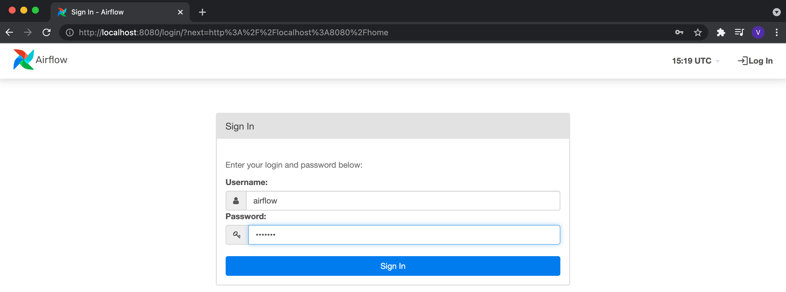
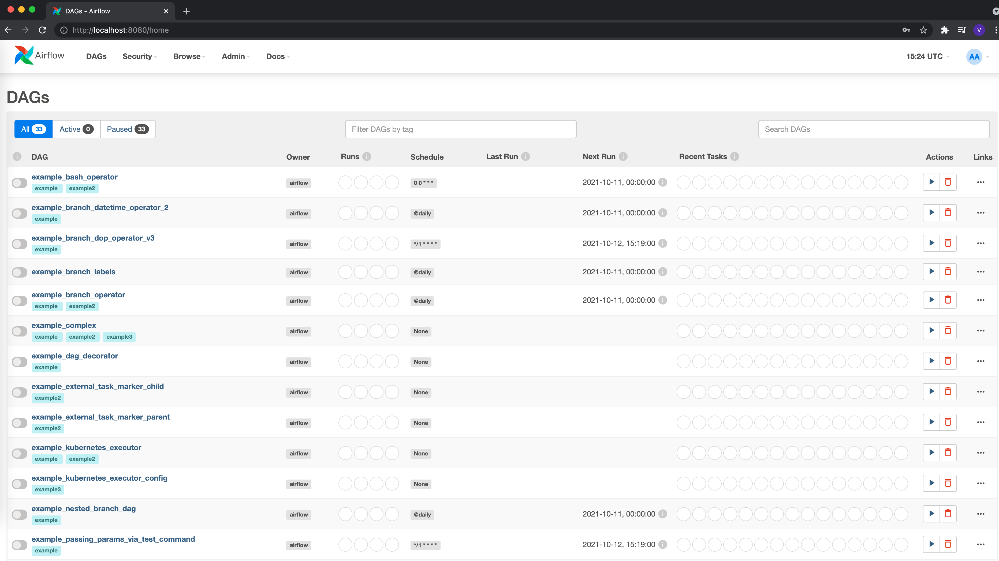
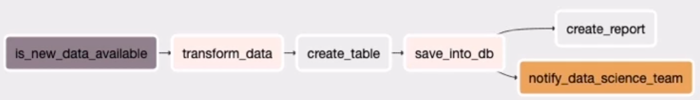
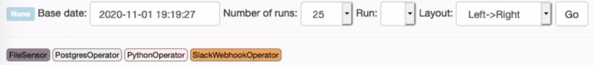
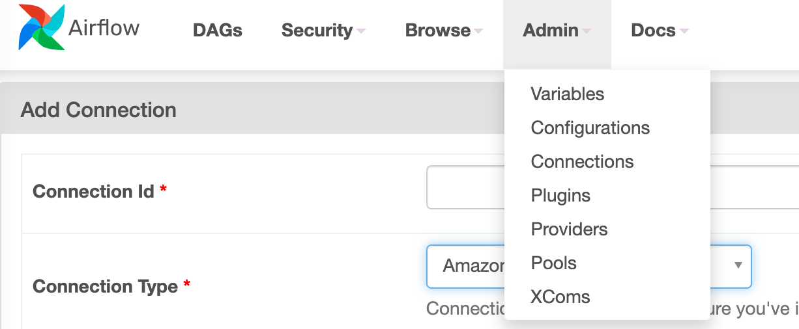
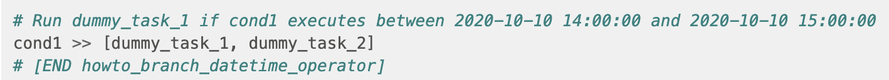
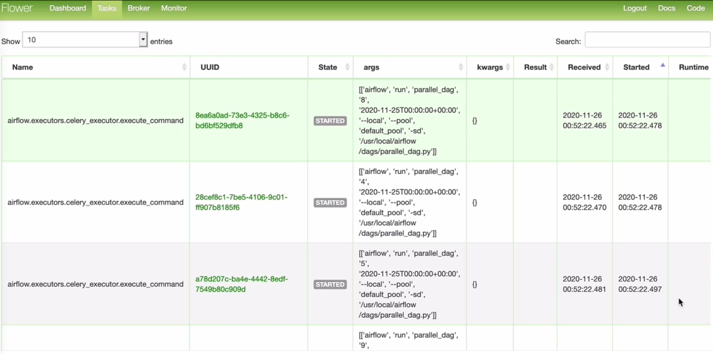

# Introduction
Analysis on **[Apache Airflow](https://airflow.apache.org/)** (AA) and collation of interesting documentation, videos and examples to help setup and run through docker, for help to develop using this very interesting tool. I just recently came across this tool and a practical application for its use with a government project I am consulting on, and found this to be a very facinating tool to add to my arsenal for solving software engineering problems. 

AA is an open source platform to programmatically orchestrate workflows. This has a built in chronological schedular and a very interesting workflow mechanism for creating task oriented solutions that can run several things sequentially and in parallel. Some slides have been shared for [Introducing Apache Airflow](./introducing-apache-airflow-slides.pdf).

Why should you learn AA? Extensibility, Reliability, Scalable and ale to guarantee SLA's.

## Exercise

- Docker compose up or down the docker implementation that can be found on the [docker setup](https://airflow.apache.org/docs/apache-airflow/stable/start/docker.html)

  ```makefile
  // Start it up
  make aaf-up
  // Shut it down and clear it
  make aaf-down
  ```

- Follow tutorial for more details withom the docker setup

- After running the docker compose up, you should have a logon on localhost to help facilitate any changes needed, default is airflow for both

  

- Once logged in there will be several example to look at or use as examples

  

- **[Concepts](https://airflow.apache.org/docs/apache-airflow/1.10.12/concepts.html)**

  - In Airflow, a `DAG` – or a **Directed Acyclic Graph** – is a collection of all the tasks you want to run, organized in a way that reflects their relationships and dependencies

  - A DAG is defined in a ***Python script*** and needs to be in a dags folder

  - a DAG describes ***how*** you want to carry out your workflow

  - The happy flow consists of the following stages:

    1. **No status** (scheduler created empty task instance)
    2. **Scheduled** (scheduler determined task instance needs to run)
    3. **Queued** (scheduler sent task to executor to run on the queue)
    4. **Running** (worker picked up a task and is now running it)
    5. **Success** (task completed)

  - DAG parameters

    - **dag_id**: Who you atr

    - **start_date**: When it starts

    - **schedule_interval**: How often to run

    - **catchup**: Should this rerun because of a prior error if set to true

    - **Other parameters** exist but those are the core params to run with, including default_args

      ```python
      from airflow import DAG
      from airflow.operators.bash import BashOperator
      
      with DAG(
          dag_id='example_bash_operator',
          schedule_interval='0 0 * * *',
          start_date=datetime(2021, 1, 1),
          catchup=False,
          dagrun_timeout=timedelta(minutes=60),
          tags=['example', 'example2'],
          params={"example_key": "example_value"},
      ) as dag:
          # Actual implementation to run to completion ...
      ```

  - Workflows are visually shown in the UI in the order they will execute on the web server using the scheduler

    

  - Once executed, a **Meta Database** stores all the workflow executions with a tasks' state and duration, users and roles and external connections

    `Schedular => Meta DB => Webserver => Execute workflows using the executor `

  - **Operators** represent tasks with a large amount at the Airflow disposal e.g. BashOperator, PythonOperator, PostgresOperator, SlackWebhookOperator

    

  - *Configuring settings* for some of these can be done through the **Admin** e.g. Connections for anything external and define settings based on the type

    

  - In the code, define **dependencies** by using the >> bit shift operator

    

  - **NOTE**: Workflows can not be infinite, so no loops

  - **Branching logic** can be done through the **BranchPythonOperator**

    ```python
    def is_tuesday(*args, **context):
        execution_date = context['execution_date']
        weekday = execution_date.in_timezone("Europe/London").weekday()
        return 'create_report' if weekday == 1 else 'none'
    
      is_tuesday_task = BranchPythonOperator(
            task_id='is_tuesday',
            python_callable=is_tuesday,
            provide_context=True
        )
      
      save_into_db >> is_tuesday_task >> [create_report, none]
    ```

  - **Trigger rule** is an alternate way of triggering on things like *all_success, all_failed, one_success, one_failed*, *all_done* and *none_failed*

    ```python
    notify_file_failed = SlackWebhookOperator(
      task_id='notify_file_failed',
      http_conn_id='slack_conn',
      webhook_token=slack_token,
      message="Error Notification ..."
      trigger_rule='all_failed',  
    ```

- **Custom operators** can be created by inheriting from the *BaseOperator* within the Airflow.models which calls the *execute* method

    ```python
    from airflow.models import BaseOperator
    
    class MyCustomOperator(BaseOperator):
        template_fields = ['mongo_query']
    
        def __init__(self,
                     custom_conn_id,
                     *args, **kwargs):
            super(MyCustomOperator, self).__init__(*args, **kwargs)
            # Conn Ids
            self.custom_conn_id = custom_conn_id
    
    
        def execute(self, context):
            """
            Executed by task_instance at runtime
            """
            custom_conn = CustomHook(self.custom_conn_id).get_conn()
    ```

    - **Usage** of the custom operator can be through Python or plugins declared in the *init package* of the python file

        ```python
        # __init__.py and COPY mongo_plugin $AIRFLOW_HOME/plugins
        from hooks.custom_hook import CustomHook
        from operators.custom_operator import CustomOperator
        
        
        class CustomPlugin(AirflowPlugin):
            name = "custom_plugin"
            operators = [CustomOperator]
            hooks = [CustomHook]
            executors = []
            macros = []
            admin_views = []
            flask_blueprints = []
            menu_links = []
           
        ```

- **Access variables and macros** using {{}} which can also be declared through Admin or in shell scripts

- **Scaling Airflow**

    - **SequentialExecutor** (default) or without parallelism, easiest to setup using a single machine and is good for debugging and developing

    - **LocalExecutor**: relatively easy to setup and brings parallelism

    - **CeleryExecutor**: Runs in multi node architecture

        - When configuring celery, utilise flower, which will setup another worker service in isolation

            ```dockerfile
             flower:
                build: docker/airflow
                image: pluralsight/airflow
                restart: always
                container_name: flower
                depends_on:
                    - redis
                    - webserver
                environment:
                    - EXECUTOR=CeleryExecutor
                    - REDIS_PASSWORD=****
                ports:
                    - "5555:5555"
                command: flower
            ```

        

- **Concurrency Parameters**

    - **task_concurrency**: How many TaskInstances for a *task*
    - **dag_concurrency**: How many TaskInstances for a *dag*
    - **worker_concurrency**: How many Taskinstances for a *worker*
    - **parallelism**: How many TaksInstances in *Airflow*

- **Testing** your dag can be done using pytest and *DagBag* see https://airflow.apache.org/docs/apache-airflow/stable/best-practices.html for more information

    ```python
    import pytest
    
    from airflow.models import DagBag
    
    
    @pytest.fixture()
    def dagbag(self):
        return DagBag()
    
    
    def test_dag_loaded(self, dagbag):
        dag = dagbag.get_dag(dag_id="hello_world")
        assert dagbag.import_errors == {}
        assert dag is not None
        assert len(dag.tasks) == 1
    ```

## Local simple Exercise

TODO: Setup a postgres database, configure some kind of json file/api to load all the latest prices and an environment that will run through docker

## References

- https://app.pluralsight.com/library/courses/productionalizing-data-pipelines-apache-airflow/table-of-contents and working examples can be found at https://github.com/axel-sirota/productionalizing-data-pipelines-airflow
- Alternatively follow the video found [here](https://www.youtube.com/watch?v=k-9GQa2eAsM) for links to doing it locally and this works with the example shown in the Apache tutorial

