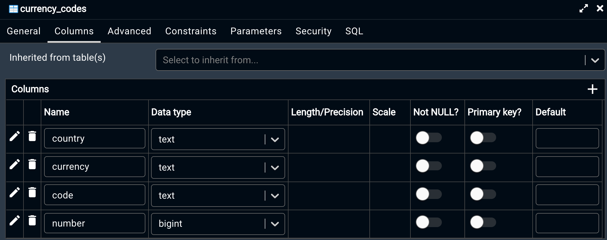

# Introduction

Analysis on **[Apache Airflow](https://airflow.apache.org/)** (AA) and collation of interesting documentation, videos and examples to help setup and run through docker, for help to develop using this very interesting tool. I just recently came across this tool and a practical application for its use with a government project I am working with, and found this to be a very facinating tool to add to my arsenal for solving software engineering problems.

AA is an open source platform to programmatically orchestrate workflows. This has a built in chronological schedular and a configurable workflow mechanism for creating task oriented solutions that can run several things sequentially and in parallel. Some slides have been shared for [Introducing Apache Airflow](./introducing-apache-airflow-slides.pdf).

Why should you learn AA? Extensibility, Reliability, Scalable and able to guarantee SLA's.

## Exercise

- Docker compose up or down the docker implementation that can be found on the [docker setup](https://airflow.apache.org/docs/apache-airflow/stable/start/docker.html)

  ```makefile
  // Start it up
  make aaf-up
  // Shut it down and clear it
  make aaf-down
  ```

- Follow tutorial for more details withom the docker setup

- After running the docker compose up, you should have a logon on localhost to help facilitate any changes needed, default is airflow for both

  

- Once logged in there will be several example to look at or use as examples

  

- **[Concepts](https://airflow.apache.org/docs/apache-airflow/1.10.12/concepts.html)**

  - In Airflow, a `DAG` – or a **Directed Acyclic Graph** – is a collection of all the tasks you want to run, organized in a way that reflects their relationships and dependencies

  - A DAG is defined in a **_Python script_** and needs to be in a dags folder

  - A DAG describes **_how_** you want to carry out your workflow

  - The happy flow consists of the following stages:

    1. **No status** (scheduler created empty task instance)
    2. **Scheduled** (scheduler determined task instance needs to run)
    3. **Queued** (scheduler sent task to executor to run on the queue)
    4. **Running** (worker picked up a task and is now running it)
    5. **Success** (task completed)

  - DAG parameters

    - **dag_id**: Who you atr

    - **start_date**: When it starts

    - **schedule_interval**: How often to run

    - **catchup**: Should this rerun because of a prior error if set to true

    - **Other parameters** exist but those are the core params to run with, including default_args

      ```python
      from airflow import DAG
      from airflow.operators.bash import BashOperator

      with DAG(
          dag_id='example_bash_operator',
          schedule_interval='0 0 * * *',
          start_date=datetime(2021, 1, 1),
          catchup=False,
          dagrun_timeout=timedelta(minutes=60),
          tags=['example', 'example2'],
          params={"example_key": "example_value"},
      ) as dag:
          # Actual implementation to run to completion ...
      ```

  - Workflows are visually shown in the UI in the order they will execute on the web server using the scheduler

    

  - Once executed, a **Meta Database** stores all the workflow executions with a tasks' state and duration, users and roles and external connections

    `Schedular => Meta DB => Webserver => Execute workflows using the executor `

  - **Operators** represent tasks with a large amount at the Airflow disposal e.g. _BashOperator, PythonOperator, PostgresOperator, SlackWebhookOperator_

    

  - _Configuring settings_ for some of these can be done through the **Admin** e.g. Connections for anything external and define settings based on the type

    

  - In the code, define **dependencies** by using the >> bit shift operator

    

  - **NOTE**: Workflows can not be infinite, so no loops

  - **Branching logic** can be done through the _BranchPythonOperator_

    ```python
    def is_tuesday(*args, **context):
        execution_date = context['execution_date']
        weekday = execution_date.in_timezone("Europe/London").weekday()
        return 'create_report' if weekday == 1 else 'none'

      is_tuesday_task = BranchPythonOperator(
            task_id='is_tuesday',
            python_callable=is_tuesday,
            provide_context=True
        )

      save_into_db >> is_tuesday_task >> [create_report, none]
    ```

  - **Trigger rule** is an alternate way of triggering on things like _all_success, all_failed, one_success, one_failed_, _all_done_ and _none_failed_

    ```python
    notify_file_failed = SlackWebhookOperator(
      task_id='notify_file_failed',
      http_conn_id='slack_conn',
      webhook_token=slack_token,
      message="Error Notification ..."
      trigger_rule='all_failed',
    ```

- **Custom operators** can be created by inheriting from the _BaseOperator_ within the Airflow.models which calls the _execute_ method

  ```python
  from airflow.models import BaseOperator

  class MyCustomOperator(BaseOperator):
      template_fields = ['mongo_query']

      def __init__(self,
                   custom_conn_id,
                   *args, **kwargs):
          super(MyCustomOperator, self).__init__(*args, **kwargs)
          # Conn Ids
          self.custom_conn_id = custom_conn_id


      def execute(self, context):
          """
          Executed by task_instance at runtime
          """
          custom_conn = CustomHook(self.custom_conn_id).get_conn()
  ```

  - **Usage** of the custom operator can be through Python or plugins declared in the _init package_ of the python file

    ```python
    # __init__.py and COPY mongo_plugin $AIRFLOW_HOME/plugins
    from hooks.custom_hook import CustomHook
    from operators.custom_operator import CustomOperator


    class CustomPlugin(AirflowPlugin):
        name = "custom_plugin"
        operators = [CustomOperator]
        hooks = [CustomHook]
        executors = []
        macros = []
        admin_views = []
        flask_blueprints = []
        menu_links = []

    ```

- **Access variables and macros** using {{}} which can also be declared through Admin or in shell scripts uses a Jinja template format, used within the `execute()` method of the operators, see more on utilising the [secrets backend](https://airflow.apache.org/docs/apache-airflow/stable/security/secrets/secrets-backend/index.html#secrets-backend-configuration) for securing values

- **Scaling Airflow**

  - **SequentialExecutor** (default) or without parallelism, easiest to setup using a single machine and is good for debugging and developing

  - **LocalExecutor**: relatively easy to setup and brings parallelism

  - **CeleryExecutor**: Runs in multi node architecture

    - When configuring celery, utilise flower, which will setup another worker service in isolation

      ```dockerfile
       flower:
          build: docker/airflow
          image: pluralsight/airflow
          restart: always
          container_name: flower
          depends_on:
              - redis
              - webserver
          environment:
              - EXECUTOR=CeleryExecutor
              - REDIS_PASSWORD=****
          ports:
              - "5555:5555"
          command: flower
      ```

    

- **Concurrency Parameters**

  - **task_concurrency**: How many TaskInstances for a _task_
  - **dag_concurrency**: How many TaskInstances for a _dag_
  - **worker_concurrency**: How many Taskinstances for a _worker_
  - **parallelism**: How many TaksInstances in _Airflow_

- **XComs** (short for "cross-communications") are a mechanism that let Tasks talk to each other, as by default Tasks are entirely isolated and may be running on entirely different machines. This is one of the many underused concepts of AA, see [this](https://www.datafold.com/blog/3-most-underused-features-of-apache-airflow) for more information on other exceptions

  - The reason this is useful, in my opinion, is for setting and getting values from Operations, for example usgae with SimpleHttpOperator and returning the reponse into a JSON object to share with the rest

  - If you return a value from a function, this value is stored in xcom. In your case, you could access it like so from other Python code:

    ```python
    task_instance = kwargs['task_instance']
    task_instance.xcom_pull(task_ids='Task1')
    # or in template
    {{ task_instance.xcom_pull(task_ids='Task1') }}
    ```

  - If you want to push a value

    ```python
    task_instance = kwargs['task_instance']
    task_instance.xcom_push(key='the_key', value=my_str)
    # Later it can be called with
    task_instance.xcom_pull(task_ids='my_task', key='the_key')
    ```

- **Testing** your dag can be done using pytest and _DagBag_ see https://airflow.apache.org/docs/apache-airflow/stable/best-practices.html for more information

  ```python
  import pytest

  from airflow.models import DagBag

  @pytest.fixture()
  def dagbag(self):
      return DagBag()

  def test_dag_loaded(self, dagbag):
      dag = dagbag.get_dag(dag_id="hello_world")
      assert dagbag.import_errors == {}
      assert dag is not None
      assert len(dag.tasks) == 1
  ```

## Exercise 1

Example for [Exercise 1](./Exercise1) creates two Dags for dealing with currencies of countries all over the world and then setting a postgres table with _currency codes_ and _exchange rates_.

**NOTE:**You need to setup and configure an exchange rate api key on https://manage.exchangeratesapi.io/dashboard and then either configure the correct URL within the [start-airflow.sh script](Exercise1/docker/airflow/start-airflow.sh) or manually modify the admin value every time you deploy your docker instance with the correct api key. Leaving it will show. fail scenario and only the base json file will be imported (good example to see a failing scenario anyway)

```bash
airflow variables --json --set 'exchange_url' 'http://api.exchangeratesapi.io/v1/latest?access_key=<Your Access Key>'
```


If you don't want to solve the problem, and just want to run the project, navigate to the solution steps


### Instructions for currency_codes.dag

- Create currency codes table with a list of currency codes that can be found [here](https://www.iban.com/currency-codes) (ignore the ones that don't have rates like **ANTARCTICA** with _No universal currency_)

- Create a table that gets generated if it does not exist

  

- Create a CSV file that represents this data as a base and imports this data into this table, and the mechanism needs to be idempotent, can create or update data if this ever changes and that csv file should be easy to update

  ```python
  # Exercise1/docker/airflow/currency-codes.csv
  country,currency,code,number
  AFGHANISTAN,Afghani,AFN,971
  .. Add the rest here
  ```

  

  Generating a spreadsheet is a good way of generating the content you will need, and then exporting the data as a comma delimited file

- **Primary key** should be on (_code_ and _country_) or (_number_ and _country_)

-

**TODO** Develop good tests and test drive the changes below

**TODO** Create one that runs in parallel

**TODO** Create a custom dag for the API using the reference below

**TODO** Create one using a proper setup ORM

### Solution steps

- Navigate to [Exercise1](./Exercise1)
- setup the API, if you haven't and configure the variables or the system before running

## References

- https://app.pluralsight.com/library/courses/productionalizing-data-pipelines-apache-airflow/table-of-contents and working examples can be found at https://github.com/axel-sirota/productionalizing-data-pipelines-airflow
- Alternatively follow the video found [here](https://www.youtube.com/watch?v=k-9GQa2eAsM) for links to doing it locally and this works with the example shown in the Apache tutorial
- [3 most under used features of Apache Airflow](https://www.datafold.com/blog/3-most-underused-features-of-apache-airflow)
- Useful [custom operator example](https://www.titanwolf.org/Network/q/1e3a5087-aa04-4e01-b526-d0d4f41c7d66/y) with test and an example of how to configure using x-com
- Adding [logger](https://newbedev.com/adding-logs-to-airflow-logs) to the dag
- Setting [variables](https://airflow.apache.org/docs/apache-airflow/stable/cli-and-env-variables-ref.html#variables) can be done through the commandline
- Postgres summary of some key ideas that will be needed
  - [Datatypes](https://www.geeksforgeeks.org/postgresql-data-types/) and [more types](https://www.postgresql.org/docs/10/datatype.html)
  - [Foreign key](https://www.postgresqltutorial.com/postgresql-foreign-key/) setup
  - [Identity column](https://www.postgresqltutorial.com/postgresql-identity-column/) setup
  - [Create table](https://www.postgresqltutorial.com/postgresql-create-table/) setup
- [Pandas documentation](https://pandas.pydata.org/docs/getting_started/index.html) and about working with tabular data, such as data stored in spreadsheets or databases
- SQL Alchemy
  - [SQL Alchemy documents](https://docs.sqlalchemy.org/en/14/intro.html) and [git repository](https://github.com/sqlalchemy/sqlalchemy) for more on a very useful [ORM](https://docs.sqlalchemy.org/en/14/orm/index.html)
  - [Simple tutorial](https://chartio.com/resources/tutorials/how-to-execute-raw-sql-in-sqlalchemy/#using-sqlalchemy) on basic concepts of Quickly setting up this with an ORM syntax
- Working with [json](https://www.w3schools.com/python/python_json.asp)
- [Docker image](https://docs.docker.com/engine/reference/commandline/image/) commands
-
